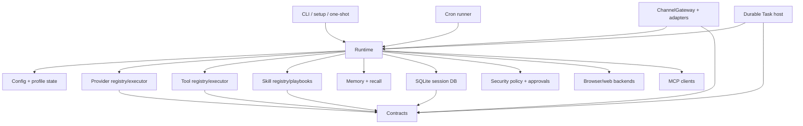

# Dependency Graph

This page maps the current source directories and the main dependency flow between them. It intentionally avoids hardcoded line counts; inspect the files directly when size matters.

## Source Map

| Area | Primary files | Role |
|---|---|---|
| Contracts | `src/contracts/*.ts` | Shared TypeScript types for providers, tools, channels, sessions, memory, durable Tasks, security, and trajectories. |
| Runtime | `src/runtime/create-runtime.ts`, `src/runtime/agent-loop.ts`, `src/runtime/provider-turn-loop.ts`, `src/runtime/tool-plan-runner.ts`, `src/runtime/runtime-router.ts` | Runtime composition, turn orchestration, provider turns, tool execution, routing, and runtime cache/fingerprint behavior. |
| Config | `src/config/runtime-config.ts`, `src/config/profile-home.ts`, `src/config/env-secret-store.ts` | Profile config loading, state-home resolution, credential references, numeric coercion, diagnostics, and config mutation helpers. |
| Providers | `src/providers/provider-executor.ts`, `src/providers/openai-compatible-provider.ts`, `src/providers/openai-responses-provider.ts`, `src/providers/runtime-credential-resolver.ts` | Provider adapters, route execution, OAuth/credential resolution, model selection, auxiliary routes, and native replay support. |
| Tools | `src/tools/tool-registry.ts`, `src/tools/tool-executor.ts`, `src/tools/*-tools.ts` | Model-visible tool schemas and execution handlers. |
| Security | `src/security/*`, `src/tools/workspace-trust-tools.ts` | Command safety, workspace trust, approval grants, hardline command floor, and target-key policy. |
| Channels | `src/channels/channel-gateway.ts`, adapter files, delivery/router/session/approval stores | Telegram, Discord, Email, WhatsApp, surface pointers, remote approvals, delivery routing, and gateway lifecycle behavior. |
| Session | `src/session/sqlite-session-db.ts`, `src/session/session-recall-service.ts`, `src/session/session-search-service.ts` | Global SQLite session persistence, recall/search, compression state, and profile isolation. |
| Memory | `src/memory/*` | Profile-local identity/memory files, shared memory, curation, promotion, indexing, recall orchestration, and memory pressure controls. |
| Skills | `src/skills/*`, `skills/official/**` | Skill loading, registry, playbooks, usage telemetry, proposals, mutation policy, bundled sync, and catalog generation. |
| Durable Tasks | `src/contracts/task.ts`, `src/workflow/task-*`, `src/cli/task-commands.ts` | Profile-scoped Tasks, Steps, Attempts, events, results, scheduler recovery, background execution, and operator controls. |
| CLI/UI | `src/cli/*`, `src/ui/*`, `src/theme/*` | Command dispatch, interactive session loop, setup commands, view models, renderers, Operator Console surfaces, bidi handling, and theme tokens. |
| Setup | `src/setup/**` | Onboarding Wizard, Setup Editor, review/apply pipeline, optional capability setup, verification, and setup copy. |
| Browser/Web | `src/browser/**`, `src/tools/web-*.ts` | URL safety, local CDP, Browserbase backend, web extraction/search providers, and debug redaction. |
| Cron | `src/cron/**` | Scheduled jobs, locks, safety checks, execution records, and delivery integration. |
| MCP/ACP | `src/mcp/**`, `src/acp/**` | MCP client/server integration and ACP editor protocol surface. |
| Eval/Smoke | `src/eval/**`, `src/smoke/**` | Deterministic eval fixtures and smoke cases. |

## Runtime Dependency Flow

## Important Boundaries

- `src/contracts/` should stay mostly type-only. Runtime behavior belongs in subsystem modules.
- `src/runtime/create-runtime.ts` is still the main composition root. Constructor changes in tools, providers, memory, skills, channels, browser, durable Tasks, or security usually flow through it.
- `AgentLoop` owns turn orchestration. Provider iteration is in `ProviderTurnLoop`; concrete tool execution is in `ToolPlanRunner` and `ToolExecutor`; deterministic native paths are in `NativeToolExecutor`.
- Runtime config loads one selected profile. Workspace trust gates behavior for a directory; it does not merge project config into the active profile.
- Channel adapters do not own approval resolution. `ChannelGateway` owns auth, session/surface routing, remote approvals, runtime cache invalidation, and delivery orchestration.
- Skills and memory can influence future behavior, so their writes must stay reviewable and bounded.
- Browser, web, MCP, package install/update, command execution, and gateway surfaces are security-sensitive and should be reviewed with the security docs open.

## Current Hotspots To Inspect

Use these files first when a change crosses subsystem boundaries:

| Change area | Start with |
|---|---|
| Runtime construction | `src/runtime/create-runtime.ts`, `src/runtime/runtime-fingerprint.ts`, `src/runtime/runtime-cache.ts` |
| Turn behavior | `src/runtime/agent-loop.ts`, `src/runtime/provider-turn-loop.ts`, `src/runtime/tool-plan-runner.ts` |
| Provider routing | `src/providers/provider-executor.ts`, `src/providers/runtime-credential-resolver.ts`, `src/config/runtime-config.ts` |
| Tool exposure/execution | `src/tools/tool-registry.ts`, `src/tools/tool-executor.ts`, `src/tools/tool-manifest.test.ts` |
| Workspace and command safety | `src/security/`, `src/tools/workspace-trust-tools.ts` |
| Channels/gateway | `src/channels/channel-gateway.ts`, `src/channels/delivery-router.ts`, adapter tests |
| Session/trajectory persistence | `src/session/sqlite-session-db.ts`, `src/trajectory/trajectory-recorder.ts`, `src/trajectory/failure-classifier.ts` |
| Memory and recall | `src/memory/memory-recall-orchestrator.ts`, `src/memory/memory-prompt-context-builder.ts`, `src/memory/memory-persistence-service.ts` |
| Skills/evolution | `src/skills/skill-loader.ts`, `src/skills/skill-proposal-service.ts`, `src/skills/skill-evolution.ts` |
| Setup/apply | `src/setup/onboarding-wizard/runner.ts`, `src/setup/config-editor/runner.ts`, `src/setup/review/apply-executor.ts` |

## Regeneration Note

No checked-in generator was found for this page. If one is added later, it should derive module lists and import edges from source instead of storing hand-maintained line counts.
