# Dependency Graph

This page shows the module-level dependencies between EstaCoda's source directories.

## Visualization

```mermaid
graph TD
    subgraph Contracts["src/contracts/ — Type Hub"]
        TOOL["tool.ts"]
        PROV["provider.ts"]
        SKILL["skill.ts"]
        SEC["security.ts"]
        CHAN["channel.ts"]
        SESS["session.ts"]
        MEM["memory.ts"]
        RTEV["runtime-event.ts"]
        ART["artifact.ts"]
        INTENT["intent.ts"]
        TPLAN["tool-plan.ts"]
        PROMPT["prompt.ts"]
        EVAL["eval.ts"]
    end

    subgraph Runtime["src/runtime/ — Orchestration"]
        AL["agent-loop.ts<br/>829 lines"]
        CRT["create-runtime.ts<br/>916 lines — FACTORY"]
        IR["intent-router.ts<br/>546 lines"]
        PTL["provider-turn-loop.ts<br/>617 lines"]
        TPR["tool-plan-runner.ts<br/>283 lines"]
        RR["run-recorder.ts<br/>524 lines"]
        SWE["skill-workflow-executor.ts<br/>260 lines"]
        NTE["native-tool-executor.ts<br/>82 lines"]
    end

    subgraph Skills["src/skills/ — Skill System"]
        SLOADER["skill-loader.ts<br/>916 lines"]
        SREG["skill-registry.ts<br/>199 lines"]
        STOOLS["skill-tools.ts<br/>1,787 lines"]
        SEVO["skill-evolution.ts<br/>676 lines"]
        SLEARN["skill-learning.ts<br/>497 lines"]
        SSYNC["skill-bundled-sync.ts<br/>417 lines"]
        SMUT["skill-mutation-policy.ts<br/>83 lines"]
        SWPLAN["skill-workflow-planner.ts<br/>148 lines"]
        STELEM["skill-usage-telemetry.ts<br/>41 lines"]
        SPS["skill-proposal-service.ts<br/>933 lines"]
    end

    subgraph Tools["src/tools/ — Tool System"]
        TEXEC["tool-executor.ts<br/>462 lines"]
        TPLANNER["tool-call-planner.ts<br/>132 lines"]
        TREG["tool-registry.ts<br/>76 lines"]
        TBUILT["builtin-tools.ts<br/>68 lines"]
        TWEB["web-tools.ts<br/>731 lines"]
        TWS["workspace-tools.ts<br/>577 lines"]
        TCODE["execute-code-tool.ts<br/>317 lines"]
        TIMG["image-generation-tools.ts<br/>410 lines"]
    end

    subgraph Providers["src/providers/ — Provider Layer"]
        PEXEC["provider-executor.ts<br/>465 lines"]
        PROUT["provider-router.ts<br/>83 lines"]
        AUXP["auxiliary-provider-router.ts<br/>184 lines"]
        OPEAI["openai-compatible-provider.ts<br/>838 lines"]
        PREG["provider-registry.ts<br/>41 lines"]
    end

    subgraph Memory["src/memory/ — Memory Layer"]
        MSTORE["memory-store.ts<br/>141 lines"]
        MRENDER["memory-renderer.ts<br/>60 lines"]
        MPROMO["memory-promotion.ts<br/>336 lines"]
        MLOCAL["local-memory-provider.ts<br/>215 lines"]
        MTOOL["memory-tool.ts<br/>82 lines"]
    end

    subgraph Security["src/security/ — Security Layer"]
        SPF["security-policy-factory.ts<br/>422 lines"]
        CSAF["command-safety.ts<br/>172 lines"]
        WAPC["workspace-approval-controller.ts<br/>350 lines"]
        WTRUST["workspace-trust-store.ts<br/>139 lines"]
    end

    subgraph Channels["src/channels/ — Channel Layer"]
        CGATE["channel-gateway.ts<br/>1,408 lines"]
        GWRUN["gateway-runner.ts<br/>463 lines"]
        TELA["telegram-adapter.ts<br/>847 lines"]
        CSSTORE["channel-session-store.ts<br/>294 lines"]
        CASTORE["channel-approval-store.ts<br/>156 lines"]
    end

    subgraph Prompt["src/prompt/ — Prompt Layer"]
        PASSEM["prompt-assembly.ts<br/>964 lines"]
        HPACK["history-packer.ts<br/>134 lines"]
        PCACHE["prompt-cache.ts<br/>47 lines"]
    end

    subgraph Session["src/session/ — Session Layer"]
        IMSESS["in-memory-session-db.ts<br/>162 lines"]
        SQLSESS["sqlite-session-db.ts<br/>550 lines"]
    end

    subgraph Trajectory["src/trajectory/ — Trajectory"]
        TREC["trajectory-recorder.ts<br/>101 lines"]
    end

    subgraph Artifacts["src/artifacts/ — Artifacts"]
        ASTORE["artifact-store.ts<br/>56 lines"]
    end

    subgraph CLI["src/cli/ — CLI"]
        CLIMAIN["cli.ts<br/>2,586 lines"]
        SLOOP["session-loop.ts<br/>906 lines"]
    end

    subgraph Smoke["src/smoke.ts — Smoke Harness"]
        SMOKE["smoke.ts<br/>9 lines — DISPATCHER"]
    end

    subgraph Evolution["src/evolution/ — Evolution"]
        EXFMT["export-format.ts<br/>71 lines"]
    end

    subgraph Subsystems["src/subsystems/ — Other"]
        CAP["capabilities/<br/>capability-setup.ts"]
        MCP["mcp/ — MCP client"]
        ACP["acp/ — ACP server"]
        CRON["cron/ — Cron jobs"]
        BROWSER["browser/ — Browser automation"]
    end

    %% Central orchestration flows
    CRT --> AL
    CRT --> IR
    CRT --> PTL
    CRT --> TPR
    CRT --> RR
    CRT --> SWE
    CRT --> NTE
    CRT --> SLOADER
    CRT --> SREG
    CRT --> STOOLS
    CRT --> SEVO
    CRT --> SPS
    CRT --> TEXEC
    CRT --> TREG
    CRT --> PEXEC
    CRT --> MLOCAL
    CRT --> SPF
    CRT --> WTRUST
    CRT --> CGATE
    CRT --> TREC
    CRT --> ASTORE
    CRT --> SQLSESS
    CRT --> MCP
    CRT --> CRON

    AL --> IR
    AL --> TEXEC
    AL --> TPLANNER
    AL --> PEXEC
    AL --> PTL
    AL --> MLOCAL
    AL --> STOOLS
    AL --> SEVO
    AL --> SLEARN
    AL --> SPS
    AL --> TREC
    AL --> PASSEM
    AL --> HPACK
    AL --> SEC
    AL --> SPF
    AL --> WAPC
    AL --> RR

    IR --> SKILL
    IR --> INTENT
    IR --> TOOL

    TEXEC --> TREG
    TEXEC --> TBUILT
    TEXEC --> TWEB
    TEXEC --> TWS
    TEXEC --> TCODE
    TEXEC --> TIMG
    TEXEC --> CSAF

    PEXEC --> PROV
    PEXEC --> OPEAI
    PEXEC --> AUXP

    STOOLS --> SKILL
    STOOLS --> TOOL
    STOOLS --> SREG
    STOOLS --> SLOADER
    STOOLS --> SPS

    SPS --> SEVO
    SPS --> SREG

    MLOCAL --> MSTORE
    MLOCAL --> MPROMO
    MLOCAL --> MRENDER

    CGATE --> TELA
    CGATE --> CSSTORE
    CGATE --> CASTORE
    CGATE --> CHAN
    CSSTORE --> CGATE

    PASSEM --> PROV
    PASSEM --> SESS
    PASSEM --> MEM
    PASSEM --> PCACHE

    SMOKE --> AL
    SMOKE --> CRT
    SMOKE --> IR
    SMOKE --> TOOL
    SMOKE --> SKILL
    SMOKE --> PROV
    SMOKE --> MEM
    SMOKE --> SEC

    style AL fill:#ff9999
    style CRT fill:#ffcccc
    style SMOKE fill:#ccffcc
    style TREC fill:#ffeb99
    style ASTORE fill:#ffeb99
    style TOOL fill:#99ccff
    style PROV fill:#99ccff
    style SKILL fill:#99ccff
```

## Key Observations

- **Contract layer is the foundation.** `src/contracts/` is imported by almost every other module. It contains pure types with no runtime logic.
- **Skill system is the largest leaf.** `src/skills/` has many internal dependencies but few external consumers outside the runtime.
- **Runtime is the integration hub.** `src/runtime/` imports from skills, tools, providers, memory, channels, and security.
- **CLI and channels are sibling consumers.** Both depend on the runtime but not on each other.
- **No circular dependencies detected** in the current source tree.
- **Smoke harness is a dispatcher.** `src/smoke.ts` is 9 lines; actual smoke cases live in `src/smoke/`.
- **Evolution is a thin export layer.** `src/evolution/` contains only the export format; logic lives in `src/skills/`.

## Hotspots (Most-Imported Contract Files)

| File | Import Count | Role |
|------|-------------|------|
| `contracts/tool.ts` | 51 | Tool definitions and risk classes |
| `contracts/provider.ts` | 24 | Provider request/response types |
| `contracts/skill.ts` | 22 | Skill definitions and workflow types |
| `contracts/eval.ts` | 20 | Eval fixture types |
| `contracts/channel.ts` | 17 | Channel types |
| `contracts/security.ts` | 16 | Security policy and decision types |

## Generated

This graph was generated from static analysis of all `src/**/*.ts` files on 2026-05-03.
**Previous version:** 2026-05-02 (stale line counts, old smoke reference, missing evolution layer).
