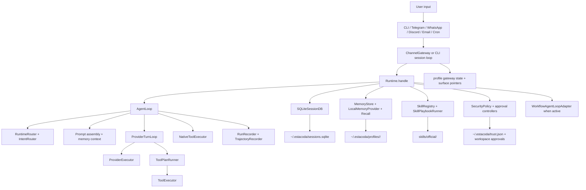

# Runtime Knowledge Graph

This page maps current runtime concepts and where to inspect them in code. It is not a roadmap and does not claim that every surface has the same maturity.

## Concept Map

## User Surfaces

| Surface | Current code path | Notes |
|---|---|---|
| CLI | `src/index.ts`, `src/cli/cli.ts`, `src/cli/session-loop.ts` | Primary local operator surface. |
| Telegram | `src/channels/telegram-adapter.ts`, `src/channels/channel-gateway.ts` | Most mature first-party remote channel. |
| WhatsApp | `src/channels/whatsapp-adapter.ts`, `scripts/whatsapp-bridge/` | Operational bridge through Baileys; external account risk remains. |
| Discord | `src/channels/discord-adapter.ts` | Implemented and test-backed; live operator validation is deployment-specific. |
| Email | `src/channels/email-adapter.ts`, `workers/email/email_worker.py` | Implemented through Python worker; live operator validation is deployment-specific. |
| Cron | `src/cron/cron-runner.ts` | Runs prompt/script jobs through fresh runtime sessions. |
| ACP | `src/acp/server.ts` | Editor integration surface. |

## State Ownership

| State | Owner | Location |
|---|---|---|
| Active profile pointer | Profile home helpers | `~/.estacoda/active-profile.json` |
| Runtime config | Selected profile | `~/.estacoda/profiles/<id>/config.json` |
| Provider secrets | Selected profile secret store / OAuth store | `~/.estacoda/profiles/<id>/.env`, `auth.json` |
| Sessions, gateway approvals, trajectories, workflows | Global SQLite DB with profile scoping | `~/.estacoda/sessions.sqlite` |
| Workspace trust and approvals | Global workspace state | `~/.estacoda/trust.json`, `workspace-approvals.json` |
| Memory files | Selected profile plus explicit shared memory | `USER.md`, `SOUL.md`, `MEMORY.md`, `memory/shared/` |
| Channel media and gateway state | Selected profile | `channel-media/`, `gateway/` |
| Skills | Bundled, profile-local, configured external roots | `skills/official/`, profile `skills/`, external roots |

## Control Boundaries

- Workspace trust is a behavior gate for local actions. It does not select or merge runtime config.
- Profiles own configuration, credentials, memory, channel state, cron state, and skills.
- Approval decisions are made before tool execution and hardline blocks are non-overridable.
- Channel authorization is separate from session identity. Surface pointers route conversations; they are not an authorization boundary by themselves.
- Agent Evolution and skill proposals remain reviewable. Bundled skills are not silently mutated.
- Recall, compression summaries, external memory, and old session content are untrusted context in prompts.

## Inspection Paths

| Question | Inspect |
|---|---|
| Why did this command/tool run or block? | `src/security/`, `src/tools/tool-executor.ts`, `src/channels/channel-gateway.ts` for remote approvals |
| Which model/credentials are used? | `src/config/runtime-config.ts`, `src/providers/runtime-credential-resolver.ts`, `src/providers/model-switch-resolver.ts` |
| Why did a channel accept/reject a message? | Adapter file, `src/channels/channel-gateway.ts`, `src/channels/adapter-capability.ts` |
| Why did recall or memory appear? | `src/memory/memory-recall-orchestrator.ts`, `src/session/session-recall-service.ts`, prompt assembly tests |
| Why did a skill load or route? | `src/skills/skill-loader.ts`, `src/skills/skill-registry.ts`, `src/runtime/runtime-router.ts` |
| How is workflow state recovered? | `src/workflow/workflow-restart-recovery.ts`, `src/workflow/sqlite-workflow-store.ts` |
| How are traces persisted? | `src/session/sqlite-session-db.ts`, `src/trajectory/trajectory-recorder.ts`, `src/cli/trace-commands.ts` |

## Current Limitations

- Some implemented adapters and optional providers need operator validation before they should be treated as production surfaces in a deployment.
- Gateway status emphasizes readiness and configured state; process/service liveness depends on the service manager path.
- Native SQLite packaging remains a release validation requirement because `better-sqlite3` uses native bindings.
- Exact semantic freshness across memory, session recall, web content, and delegation is bounded; current stale-file warnings cover tracked parent reads vs. child file writes.
