# Runtime Knowledge Graph

This page maps the conceptual relationships between runtime entities.

## Visualization

```mermaid
graph TB
    subgraph User["User Surfaces"]
        CLI["CLI (src/cli/)"]
        TELEGRAM["Telegram (src/channels/telegram-adapter.ts)"]
        CRON["Cron (src/cron/)"]
    end

    subgraph Runtime["Agent Runtime (src/runtime/)"]
        AL["AgentLoop<br/>Decomposed Orchestrator"]
        IR["IntentRouter<br/>Intent Classification"]
        CRT["createRuntime()<br/>Factory"]
        PTL["ProviderTurnLoop<br/>Streaming Loop"]
        TPR["ToolPlanRunner<br/>Plan Execution"]
        RR["RunRecorder<br/>Trajectory Capture"]
        SWE["SkillWorkflowExecutor<br/>Skill Execution"]
        NTE["NativeToolExecutor<br/>Deterministic Intents"]
    end

    subgraph Evolution["Evolution Layer (src/skills/ + src/evolution/)"]
        SPS["SkillProposalService<br/>Proposal & Manifest Logic"]
        SEVO["SkillEvolutionStore<br/>Telemetry & Proposals"]
        CM["ChangeManifest<br/>Evidence-Backed Changes"]
        CUR["Curator<br/>Status & Recommendations"]
        EXFMT["OptimizationDataset<br/>DSPy/GEPA Export"]
    end

    subgraph Security["Security Layer (src/security/)"]
        SP["SecurityPolicy<br/>allow/ask/deny"]
        CSAF["CommandSafety<br/>Risk Assessment"]
        WTRUST["WorkspaceTrustStore"]
        WAPC["WorkspaceApprovalController"]
    end

    subgraph Skills["Skill System (src/skills/)"]
        SLOAD["SkillLoader<br/>Load bundled/local/external"]
        SREG["SkillRegistry<br/>Catalog & Lookup"]
        SWPLAN["SkillWorkflowPlanner<br/>Compile Plans"]
        SEVO["SkillEvolutionStore<br/>Propose Patches"]
        SLEARN["SkillLearningManager<br/>Telemetry & Learning"]
        STOOLS["SkillTools<br/>Skill-specific Tool Dispatch"]
    end

    subgraph Tools["Tool System (src/tools/)"]
        TEXEC["ToolExecutor<br/>Execute Tools"]
        TPLAN["ToolCallPlanner<br/>Plan Tool Calls"]
        TREG["ToolRegistry<br/>Tool Catalog"]
        TBUILTIN["Builtin Tools<br/>File, Shell, Search"]
        TWEB["Web Tools<br/>Fetch, Browse"]
        TCODE["Code Tools<br/>Execute Code"]
        TWS["Workspace Tools<br/>File Operations"]
    end

    subgraph Providers["Provider Layer (src/providers/)"]
        PEXEC["ProviderExecutor<br/>Call LLM"]
        PROUT["ProviderRouter<br/>Route to Provider"]
        OPEAI["OpenAICompatibleProvider<br/>Adapter"]
        AUXP["Auxiliary Model Resolver<br/>Task Routes"]
    end

    subgraph Memory["Memory Layer (src/memory/)"]
        MPROV["LocalMemoryProvider<br/>Memory Interface"]
        MSTORE["MemoryStore<br/>File Storage"]
        MRENDER["MemoryRenderer<br/>Prompt Packing"]
        MPROMO["MemoryPromotion<br/>Promotion Rules"]
        MSCAN["MemoryScanner<br/>Scan & Index"]
    end

    subgraph Session["Session Layer (src/session/)"]
        SDB["SessionDB<br/>In-Memory / SQLite"]
    end

    subgraph Prompt["Prompt Layer (src/prompt/)"]
        PASSEM["PromptAssembly<br/>Build Prompt"]
        HPACK["HistoryPacker<br/>Compress History"]
        PCACHE["PromptCache<br/>Cache Prompts"]
    end

    subgraph Trajectory["Trajectory Layer (src/trajectory/)"]
        TREC["TrajectoryRecorder<br/>101 lines"]
    end

    subgraph Artifacts["Artifact Layer (src/artifacts/)"]
        ASTORE["ArtifactStore<br/>56 lines"]
    end

    subgraph Eval["Eval Layer (src/eval/)"]
        ERUN["EvalRunner<br/>Deterministic Fixtures"]
        EFIX["EvalFixtures<br/>18 Cases"]
    end

    subgraph MCP["MCP Layer (src/mcp/)"]
        MCPCL["MCPClient<br/>External Tool Server"]
        MCPTL["MCPTools<br/>Tool Adapter"]
    end

    subgraph Cron["Cron Layer (src/cron/)"]
        CRUN["CronRunner<br/>Execute Scheduled Tasks"]
        CSTOR["CronStore<br/>Persist Jobs"]
        CSAF2["CronSafety<br/>Safety Checks"]
    end

    subgraph Channels["Channel Layer (src/channels/)"]
        CGATE["ChannelGateway<br/>Route Messages"]
        GWRUN["GatewayRunner<br/>Run Gateway"]
        CSSTORE["ChannelSessionStore<br/>Session Mapping"]
        CASTORE["ChannelApprovalStore<br/>Approval State"]
    end

    subgraph Config["Config Layer (src/config/)"]
        RCFG["RuntimeConfig<br/>Configuration"]
        ESECR["EnvSecretStore<br/>Secrets"]
    end

    %% Main data flows
    CLI --> AL
    TELEGRAM --> CGATE --> AL
    CRON --> CRUN --> AL

    AL --> IR
    AL --> SP
    AL --> SLOAD
    AL --> SREG
    AL --> SWPLAN
    AL --> STOOLS
    AL --> TEXEC
    AL --> TPLAN
    AL --> PEXEC
    AL --> PTL
    AL --> TPR
    AL --> RR
    AL --> MPROV
    AL --> PASSEM
    AL --> TREC
    AL --> ASTORE
    AL --> SDB

    IR --> SREG
    IR --> TBUILTIN

    SP --> CSAF
    SP --> WTRUST
    SP --> WAPC

    SLOAD --> SREG
    SEVO --> SREG
    SLEARN --> SREG
    STOOLS --> TEXEC
    SWPLAN --> TPLAN
    SPS --> SEVO
    SPS --> SREG
    SPS --> CM
    CUR --> SPS

    TEXEC --> TREG
    TEXEC --> TBUILTIN
    TEXEC --> TWEB
    TEXEC --> TCODE
    TEXEC --> TWS
    TEXEC --> CSAF

    PEXEC --> PROUT
    PEXEC --> OPEAI
    PEXEC --> AUXP
    MPROV --> MSTORE
    MPROV --> MRENDER
    MPROV --> MPROMO

    PASSEM --> HPACK
    PASSEM --> PCACHE
    PASSEM --> MRENDER
    PASSEM --> SDB

    TREC --> AL
    ASTORE --> AL
    RR --> AL

    CRT --> AL
    CRT --> IR
    CRT --> SP
    CRT --> SLOAD
    CRT --> SREG
    CRT --> STOOLS
    CRT --> SEVO
    CRT --> SPS
    CRT --> TEXEC
    CRT --> TREG
    CRT --> PEXEC
    CRT --> MPROV
    CRT --> SDB
    CRT --> TREC
    CRT --> ASTORE
    CRT --> CGATE
    CRT --> CRUN
    CRT --> MCPCL
    CRT --> ERUN

    ERUN --> EFIX
    EFIX --> SPS
    CM --> SPS

    %% Durable state
    MSTORE -.->|"Durable"| DISK1[("profiles/<id>/USER.md + SOUL.md + MEMORY.md")]
    SDB -.->|"Durable"| DISK2[("~/.estacoda/sessions.sqlite + profile_id")]
    SREG -.->|"Durable"| DISK3[("profiles/<id>/skills/")]
    CSTOR -.->|"Durable"| DISK4[("profiles/<id>/cron/")]
    WTRUST -.->|"Durable"| DISK5[("~/.estacoda/trust.json")]
    SLEARN -.->|"Durable"| DISK6[("~/.estacoda/skill-learning.json")]

    style AL fill:#ff9999,stroke:#cc0000,stroke-width:2px
    style CRT fill:#ffcccc,stroke:#cc0000,stroke-width:2px
    style TREC fill:#ffeb99,stroke:#cc9900,stroke-width:2px
    style ASTORE fill:#ffeb99,stroke:#cc9900,stroke-width:2px
```

## Entity Descriptions

| Entity | Responsibility | File |
|--------|---------------|------|
| `AgentLoop` | Core turn orchestration (decomposed) | `src/runtime/agent-loop.ts` |
| `createRuntime` | Composition root | `src/runtime/create-runtime.ts` |
| `IntentRouter` | Native intent classification | `src/runtime/intent-router.ts` |
| `ProviderTurnLoop` | Streaming provider execution | `src/runtime/provider-turn-loop.ts` |
| `ToolPlanRunner` | Tool plan execution | `src/runtime/tool-plan-runner.ts` |
| `RunRecorder` | Run recording and trajectory | `src/runtime/run-recorder.ts` |
| `SkillWorkflowExecutor` | Skill workflow execution | `src/runtime/skill-workflow-executor.ts` |
| `NativeToolExecutor` | Deterministic native intent execution | `src/runtime/native-tool-executor.ts` |
| `ProviderExecutor` | Streaming provider execution | `src/providers/provider-executor.ts` |
| `ToolExecutor` | Concrete tool execution | `src/tools/tool-executor.ts` |
| `ToolCallPlanner` | Plan conversion | `src/tools/tool-call-planner.ts` |
| `SkillRegistry` | Skill storage and visibility | `src/skills/skill-registry.ts` |
| `SkillProposalService` | Proposal and manifest logic | `src/skills/skill-proposal-service.ts` |
| `SkillEvolutionStore` | Telemetry and proposals | `src/skills/skill-evolution.ts` |
| `MemoryStore` | Bounded memory files | `src/memory/memory-store.ts` |
| `LocalMemoryProvider` | Memory read/write | `src/memory/local-memory-provider.ts` |
| `TrajectoryRecorder` | Event recording | `src/trajectory/trajectory-recorder.ts` |
| `ArtifactStore` | Artifact collection | `src/artifacts/artifact-store.ts` |
| `ChannelGateway` | Generic channel bridge | `src/channels/channel-gateway.ts` |
| `TelegramAdapter` | Telegram specifics | `src/channels/telegram-adapter.ts` |
| `SecurityPolicy` | Policy evaluation | `src/security/security-policy-factory.ts` |
| `WorkspaceTrustStore` | Trust grants | `src/security/workspace-trust-store.ts` |
| `EvalRunner` | Deterministic fixture runner | `src/eval/eval-runner.ts` |

## Generated

This graph was generated from static analysis of `src/**/*.ts` on 2026-05-03.
**Previous version:** 2026-05-02 (stale decomposition status, missing evolution layer, missing eval layer).
